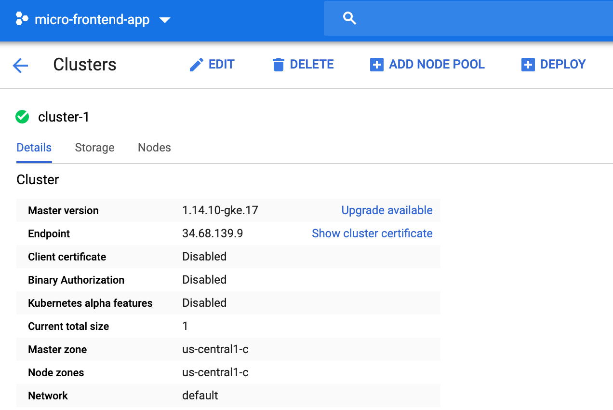

# Vue Microfrontends root-config

[](https://circleci.com/gh/vue-microfrontends/root-config)

## What is this?

This is an example microfrontend repo demonstrating how to use [single-spa](https://single-spa.js.org). You can see the code running at https://vue.microfrontends.app.

## How does it work?

[Full article](https://single-spa.js.org/docs/recommended-setup)

This repository is a javascript project that creates a javascript bundle that is an in-browser javascript module (explanation on [youtube](https://www.youtube.com/watch?v=Jxqiu6pdMSU&list=PLLUD8RtHvsAOhtHnyGx57EYXoaNsxGrTU&index=2) / [bilibili](https://www.bilibili.com/video/av83498486/)). The currently deployed version of the in-browser module can be seen at https://vue.microfrontends.app/importmap.json.

This project uses [Vue](https://vuejs.org) and was created with the [create-single-spa](https://single-spa.js.org/docs/create-single-spa) CLI. It uses webpack and babel.

Whenever a pull request is merged to master, [CircleCI builds and deploys the project](https://circleci.com/gh/vue-microfrontends/root-config). The ["workflows" view](https://circleci.com/gh/vue-microfrontends/workflows) (pictured below) can be seen if you are logged into CircleCI. Deployments for this in-browser module are completely independent of deployments for any other module.


## Local development

[Full documentation](https://single-spa.js.org/docs/recommended-setup#local-development)

Tutorial video: [youtube](https://www.youtube.com/watch?v=vjjcuIxqIzY&list=PLLUD8RtHvsAOhtHnyGx57EYXoaNsxGrTU&index=4) / [bilibili](https://www.bilibili.com/video/av83617789/)

There are two ways to do local development. It is preferred to do one module at a time, whenever possible.

### One module at a time

```sh
cd root-config
yarn install
yarn start --https
```

Go to https://localhost:9000/vue-mf-root-config.js and verify that you are able to load the file without any SSL problems. To solve SSL problems, see [these instructions](https://improveandrepeat.com/2016/09/allowing-self-signed-certificates-on-localhost-with-chrome-and-firefox/).

Now, go to https://vue.microfrontends.app. In the browser console, run the following:

```js
localStorage.setItem('devtools', true);
```

Refresh the page. Click on the tan / beige rectangle:


Set an [import map override](https://github.com/joeldenning/import-map-overrides/) to `9000`.


Refresh the page. Your local code for this module will now be running on https://vue.microfrontends.app. You may make changes locally and refresh the page to see them.

### All modules together

Run the root-config project locally:

```
cd root-config
yarn install
yarn start
```

Now follow the steps above for "One module at a time" for each of the modules you wish to work on.

## Adapting for your organization

Feel free to fork and modify any files you would like when doing a proof of concept for your organization. When it's time to actually create / adapt your organization's projects, consider using [create-single-spa](https://single-spa.js.org/docs/create-single-spa) instead of forking this repository.

## CircleCI setup

- [Video: Deploying Microfrontends Part 1 - Import Map Deployer](https://www.youtube.com/watch?v=QHunH3MFPZs&list=PLLUD8RtHvsAOhtHnyGx57EYXoaNsxGrTU&index=5)
- [Video: Deploying Microfrontends Part 2 - CI for in-browser modules](https://www.youtube.com/watch?v=nC7rpDXa4B8&list=PLLUD8RtHvsAOhtHnyGx57EYXoaNsxGrTU&index=6)

Setup a CircleCI context with the following variables configured

- `BUCKET_NAME`
- `CF_PUBLIC_URL`
- `DEPLOYER_ENV`
- `DEPLOYER_HOST`
- `DEPLOYER_PASSWORD`
- `DEPLOYER_USERNAME`
- `GOOGLE_APPLICATION_CREDENTIALS_JSON`

## Import Maps Deployer

To deploy new releases of micro frontends, you will need to use [import-map-deployer](https://github.com/single-spa/import-map-deployer)

## Cloud run

Go to [Cloud Run](https://cloud.google.com/run/docs/deploying) and follow instructions to deploy an image.


### Kubernetes Cluster setup for Import Maps Deployer

Create a new cluster


Set min/max nodes to 1 (to avoid concurrency issues)


Grant access to write to Storage (similar to S3 bucket)


You need to give the cluster either `Read and Write` or `Full` access to Storage


Create the cluster


## Create storage

Select `Create bucket`


Name bucket


Select `Region`


Grant `Uniform` access


Click `Create`

# Deploying import map deployer to Kubernetes Cluster

- [Install docker](https://hub.docker.com/editions/community/docker-ce-desktop-mac/)
- [Install minikube](https://kubernetes.io/docs/tasks/tools/install-minikube/)

```sh
$ minikube status
$ minikube start
🎉  minikube 1.7.3 is available! Download it: https://github.com/kubernetes/minikube/releases/tag/v1.7.3
💡  To disable this notice, run: 'minikube config set WantUpdateNotification false'

🙄  minikube v1.7.2 on Darwin 10.15.3
✨  Using the hyperkit driver based on existing profile
⌛  Reconfiguring existing host ...
🔄  Starting existing hyperkit VM for "minikube" ...
🐳  Preparing Kubernetes v1.17.2 on Docker 19.03.5 ...
🚀  Launching Kubernetes ... 
🌟  Enabling addons: default-storageclass, storage-provisioner
🏄  Done! kubectl is now configured to use "minikube"
```

Also install `gcloud` the [Google Cloud CLI](https://cloud.google.com/sdk/gcloud/#downloading_the_gcloud_command-line_tool)

Alternatively use the [Google Cloud shell](https://cloud.google.com/shell/)

[Interactive gcloud download](https://cloud.google.com/sdk/docs/downloads-interactive)

`$ gcloud components update`

`import-map-deployer` is available on DockerHub as [singlespa/import-map-deployer](hub.docker.com/repository/docker/singlespa/import-map-deployer)

To push any local image to Container Registry, you need to first tag it with the registry name and then push the image

You can specify a container image with a tag (ie. `gcr.io/my-project/my-image:latest`)

Choose a hostname, which specifies location where you will store the image:

- `us.gcr.io` hosts image in data centers in the United States
- `eu.gcr.io` hosts the images in the European Union
- `asia.gcr.io` hosts images in data centers in Asia

Combine the hostname, your Google Cloud Console project ID, and image name:

`[HOSTNAME]/[PROJECT-ID]/[IMAGE]`

Configure gcloud for docker

```sh
$ gcloud auth configure-docker
After update, the following will be written to your Docker config file
 located at /Users/[username]/.docker/config.json:
 {
  "credHelpers": {
    "gcr.io": "gcloud",
    "marketplace.gcr.io": "gcloud",
    "eu.gcr.io": "gcloud",
    "us.gcr.io": "gcloud",
    "staging-k8s.gcr.io": "gcloud",
    "asia.gcr.io": "gcloud"
  }
}
```

Now clone the `import-map-deployer` repo

```sh
$ git clone git@github.com:single-spa/import-map-deployer.git
```

Build the docker image

```sh
$ docker build .
# ...
Successfully built 5047af9771ae
```

Tag it correctly according to the [Google Cloud specification](https://cloud.google.com/container-registry/docs/pushing-and-pulling)

```sh
$ docker tag 5047af9771ae us.gcr.io/micro-frontend-app/importmap-deployer:dev
```

Push the tagged image to Google Cloud

```sh
$ docker push us.gcr.io/micro-frontend-app/importmap-deployer:dev
The push refers to repository [us.gcr.io/micro-frontend-app/importmap-deployer:dev]
320b46caf779: Pushed
acbc324f81b2: Pushed
d32c38cd5689: Pushed
3fc64803ca2d: Layer already exists
latest: digest: sha256:ae8fa7dd5aecfe7c6c565b1d3453e665e4300140a6f8ae9f8c99163311f5123d size: 1162
```

## Deploy image

Go to GCP clusters. See cluster details. Click `Deploy` button in action bar



On the Create Deployment select `New container image` and click `Select` to select it


Select the image to deploy by clicking down arrow on image tag name


Then select the image version to deploy


The selected image should now be displayed


Click `Done` and `Continue` to enter the `Configuration`


Enter an application name, then scroll to the bottom and click `Deploy`

### Troubleshooting deploy

In case you get deployment errors...

Deployment Error


Deployment Details


## Troubleshoot docker

[Mac OS Troubleshoot: Can't connect to Docker daemon](https://stackoverflow.com/questions/44084846/cannot-connect-to-the-docker-daemon-on-macos)

Make sure the docker whale icon is visible in the top status bar. If not, go to `Applications` and 
activate the `Docker app` whale icon to start Docker.
